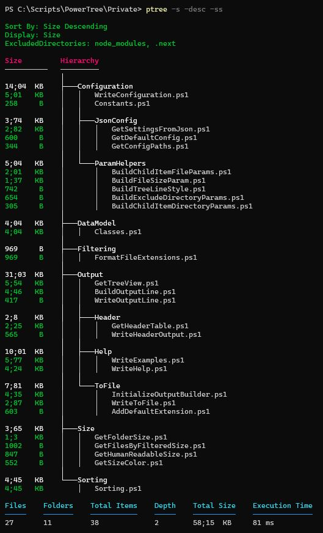
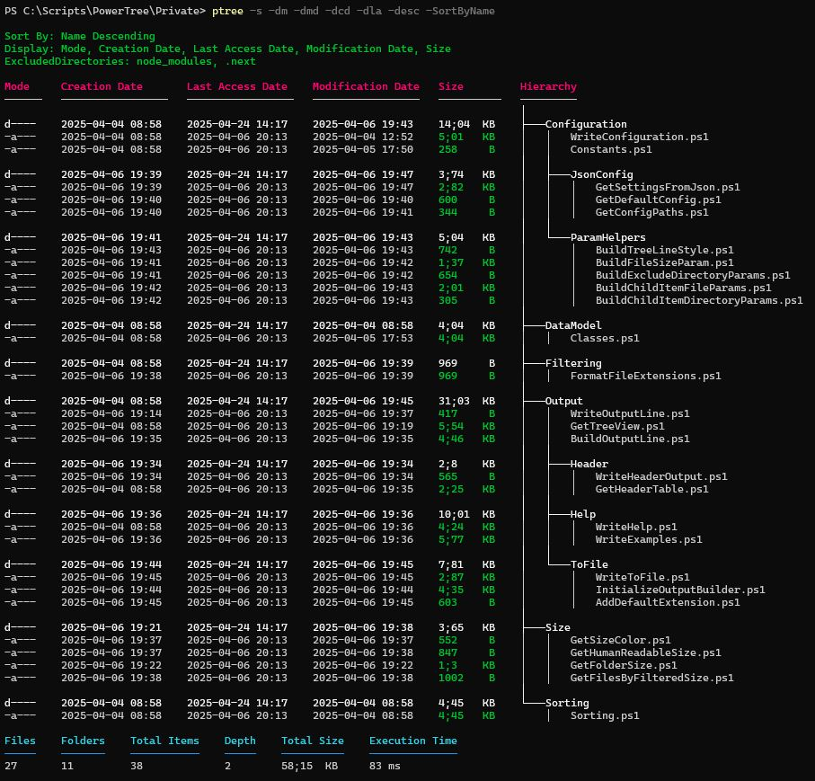
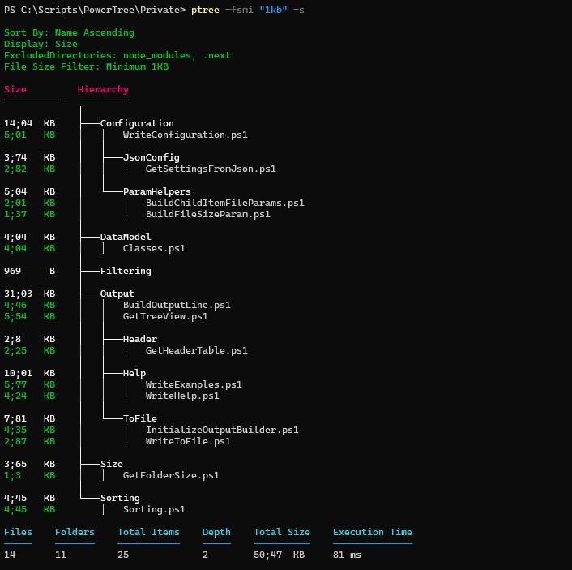
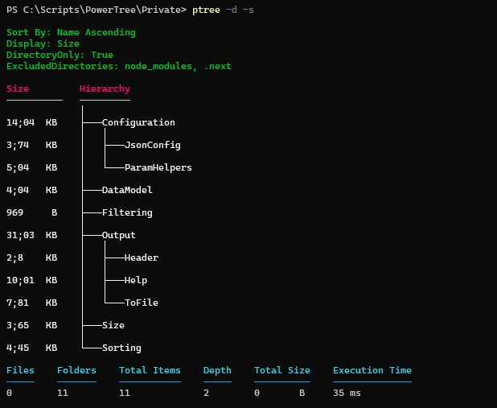
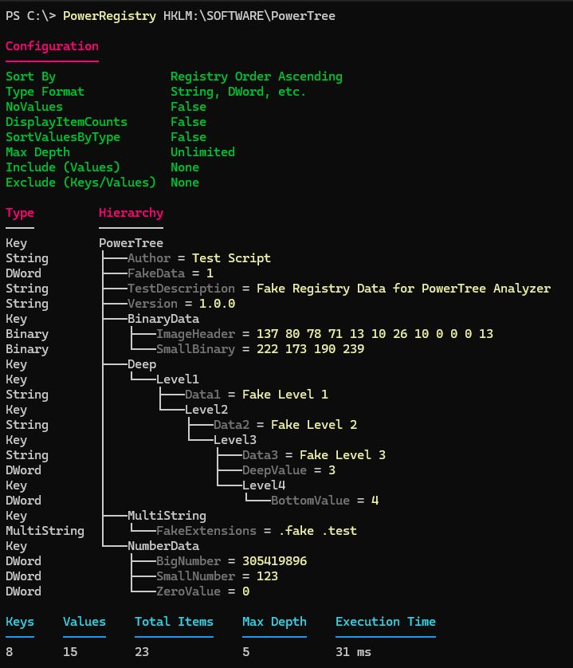
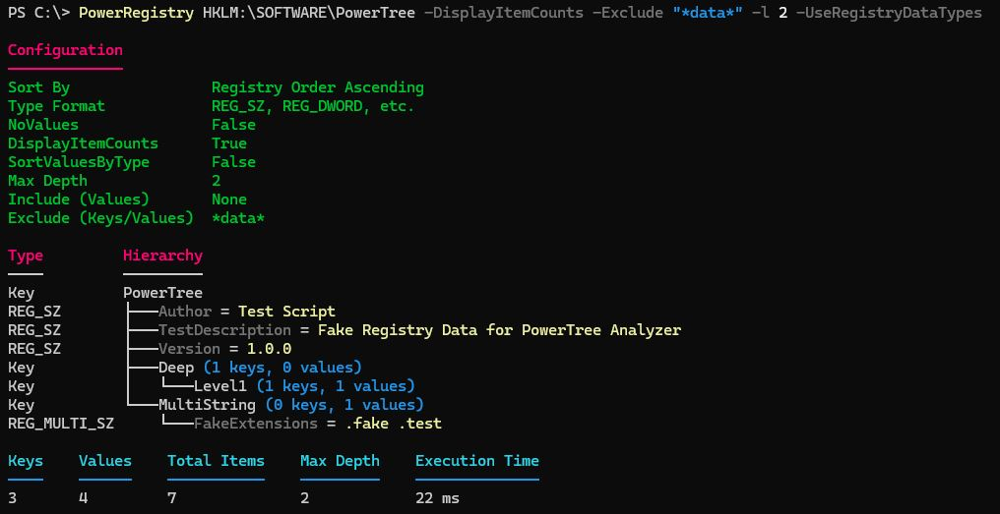

# PowerTree

A modern replacement for the `tree` command that lets you explore directory structures and Windows Registry with detailed information and advanced filtering possibilities.

[](https://www.powershellgallery.com/packages/PowerTree)
[](https://www.powershellgallery.com/packages/PowerTree)


## Preview Videos
<details>
<summary>🎥 File System Explorer Demo</summary>
https://github.com/user-attachments/assets/3fbe8eb4-0844-4df8-925a-0608e391be17
</details>
<details>
<summary>🗂️ Registry Explorer Demo</summary>
https://github.com/user-attachments/assets/f95b4eb9-72ce-48db-aeca-0b16e81b14bf
</details>

## What is PowerTree?

PowerTree is a comprehensive tree visualization tool that provides two main capabilities:

- **File System Explorer**: A modern alternative to the traditional `tree` command with advanced filtering, sorting, and display options
- **Registry Explorer**: Windows Registry visualization in tree format (Windows only)

Unlike standard tree commands, PowerTree offers detailed information display, multiple sorting options, filtering capabilities, and customizable configuration.

## Installation

From [PowerShell Gallery](https://www.powershellgallery.com/packages/PowerTree):

```powershell
Install-Module PowerTree
```

# Commands

## Show-PowerTree   <sup><sub>Alias: `ptree`, `PowerTree`</sub></sup>
A modern replacement for the tree command that lets you explore directory structures with detailed information and advanced filtering possibilities. Explore all available parameters and advanced features in the [full documentation](docs/Show-PowerTree.md).

### Example Images

<details>
  <summary>File system with sizes sorted by size descending</summary>
  <br>

```powershell
ptree -DisplaySize -Descending -SortBySize
```

  
</details>

<details>
  <summary>All display options with name sorting</summary>
  <br>

```powershell
ptree -DisplayAll -Descending -SortByName
```

  
</details>

<details>
  <summary>File size filtering</summary>
  <br>

```powershell
ptree -FileSizeMinimum "1kb" -DisplaySize
```

  
</details>

<details>
  <summary>Directory only view</summary>
  <br>

```powershell
ptree -DirectoryOnly -DisplaySize
```

  
</details>

## Show-PowerTreeRegistry   <sup><sub>Alias: `ptreer`, `PowerRegistry`</sub></sup>
Shows Windows Registry keys and values in tree format. Displays both registry keys and their values, making it easy to see the structure of any registry hive or specific key. Explore all available parameters and advanced features in the [full documentation](docs/Show-PowerTreeRegistry.md).

### Example Images

<details>
    <summary>Default Registry View</summary>
    <br>
  
```powershell
PowerRegistry HKLM:\SOFTWARE\ 
```
 <br>
    
</details>

<details>
    <summary>Filtered Registry View</summary>
    <br>
  
```powershell
PowerRegistry HKLM:\SOFTWARE\ -DisplayItemCounts -Exclude "*data*" -l 2 -UseRegistryDataTypes
```
 <br>
    
</details>

## Edit-PowerTreeConfig   <sup><sub>Alias: `Edit-PowerTree`, `Edit-ptree`</sub></sup>
Opens the configuration file to change default settings. Set which directories to always exclude, default sorting, and tree display style. Explore all available parameters and advanced features in the [full documentation](docs/Edit-PowerTreeConfig.md).

## Common Use Cases

### System Administration

```powershell
# Find large files consuming disk space
ptree -DisplaySize -SortBySize -Descending -FileSizeMinimum 100MB

# Document directory structure for compliance
ptree -DisplayAll -OutFile system_audit.txt

# Audit installed software and versions
Show-PowerTreeRegistry -Path "HKLM:\SOFTWARE\Microsoft\Windows\CurrentVersion\Uninstall" -Depth 2 -OutFile "output.txt"
```

### Development Workflows

```powershell
# Exclude build artifacts and show only source files
ptree -ExcludeDirectories bin,obj,node_modules -IncludeExtensions cs,js,ts

# Check project structure and sizes
ptree -DisplaySize -ExcludeDirectories .git,.vs -Depth 3

# Export project documentation
ptree -IncludeExtensions md,txt -OutFile project_docs.txt
```

## Documentation

For detailed parameter references and advanced usage examples:

- **[Show-PowerTree](docs/Show-PowerTree.md)** 
- **[Show-PowerTreeRegistry](docs/Show-PowerTreeRegistry.md)**
- **[Edit-PowerTreeConfig](docs/Edit-PowerTreeConfig.md)**

## License

This project is licensed under the MIT License - see the [LICENSE](LICENSE) file for details.

## Author

Created by Bart Spaans

## Contributing

Contributions are welcome! Please feel free to submit a Pull Request.

### Upcoming Features

- Git integration (automatic .gitignore exclusion)
- Export function signatures from JavaScript/TypeScript files
- Access Control List (ACL) display options
- Enhanced registry data type visualization
